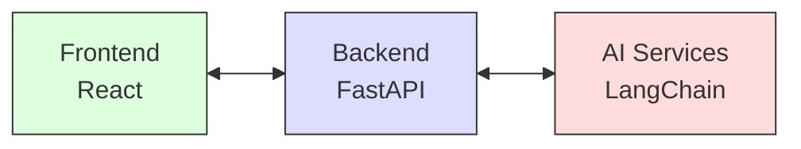

# Document-Aware AI Assistant

[](https://fastapi.tiangolo.com/)
[](https://reactjs.org/)
[](https://www.typescriptlang.org/)
[](https://www.python.org/)
[](https://opensource.org/licenses/MIT)

<div align="center">
  
  
  _An intelligent AI assistant that can read, understand, and reason through documents._
</div>

## 📚 Table of Contents

- [Features](#-features)
- [Architecture](#-architecture)
- [Tech Stack](#-tech-stack)
- [Getting Started](#-getting-started)
- [Project Structure](#-project-structure)
- [API Documentation](#-api-documentation)
- [Development](#-development)
- [Contributing](#-contributing)
- [License](#-license)

## ✨ Features

- 📄 Document Upload (PDF/TXT support)
- 📝 Auto-Summary Generation (≤ 150 words)
- ❓ Ask Anything Mode (Free-form Q&A with context)
- 🎯 Challenge Me Mode (Interactive Learning with auto-generated questions)
- 🔍 Document-based Response Justification
- ⚡ Real-time feedback and evaluation

## 🏗 Architecture

### System Components



### Data Flow

1. **Document Processing** 🔄
   - Document upload (PDF/TXT)
   - Text extraction and cleaning
   - Vector embeddings generation
   - FAISS vector store creation

2. **Question Answering** 💭
   - Context retrieval using vector similarity
   - Question-answer generation using RoBERTa
   - Answer evaluation and scoring

3. **Challenge Mode** 🎮
   - Diverse context selection
   - Intelligent question generation
   - Answer evaluation with similarity scoring

## 🛠 Tech Stack

### Frontend
- ⚛️ React with TypeScript
- 🎨 Material-UI components
- 🔌 Axios for API communication

### Backend
- ⚡ FastAPI for REST API
- 🔗 LangChain for document processing
- 🤗 Hugging Face Transformers
- 🔍 FAISS for vector storage

### AI/ML Components
- 🤖 RoBERTa for QA tasks
- 🔤 Sentence Transformers for embeddings
- 📊 Custom evaluation metrics

## 🚀 Getting Started

### Prerequisites

Before you begin, ensure you have the following installed:
- Python 3.9 or higher
- Node.js 14 or higher
- npm or yarn

### Quick Start

1. **Clone the repository**
```bash
git clone https://github.com/yourusername/document-ai-assistant.git
cd document-ai-assistant
```

2. **Backend Setup**
```bash
# Create and activate virtual environment
python -m venv venv

# Unix/macOS
source venv/bin/activate
# Windows
venv\Scripts\activate

# Install dependencies
pip install -r requirements.txt

# Start the server
uvicorn backend.main:app --reload --host 0.0.0.0 --port 8000
```

3. **Frontend Setup**
```bash
# Navigate to frontend directory
cd frontend

# Install dependencies
npm install
# or
yarn install

# Start development server
npm start
# or
yarn start
```

Visit http://localhost:3000 to see the application in action!

## 📁 Project Structure

```
.
├── backend/
│   ├── main.py                 # FastAPI application
│   ├── models/
│   │   ├── document.py        # Data models
│   │   └── __init__.py
│   ├── services/
│   │   ├── document_processor.py  # Document processing
│   │   ├── qa_service.py         # QA pipeline
│   │   ├── state.py             # Application state
│   │   └── __init__.py
│   └── utils/
│       └── __init__.py
├── frontend/
│   ├── src/
│   │   ├── components/
│   │   │   ├── AskAnything.tsx    # QA interface
│   │   │   ├── ChallengeMode.tsx  # Challenge interface
│   │   │   └── DocumentUpload.tsx # Upload interface
│   │   ├── App.tsx
│   │   └── index.tsx
│   ├── public/
│   └── package.json
├── requirements.txt
└── README.md
```

## 📚 API Documentation

### Endpoints

| Method | Endpoint | Description |
|--------|----------|-------------|
| POST | `/upload` | Upload and process documents |
| POST | `/ask` | Ask questions about the document |
| POST | `/challenge` | Generate challenge questions |
| POST | `/evaluate` | Evaluate user answers |

For detailed API documentation, visit http://localhost:8000/docs after starting the backend server.

## 💻 Development

### Code Style

- Follow [PEP 8](https://www.python.org/dev/peps/pep-0008/) for Python code
- Use [ESLint](https://eslint.org/) and [Prettier](https://prettier.io/) for TypeScript/React code
- Maintain consistent naming conventions

### Error Handling
- Implement proper error boundaries
- Provide meaningful error messages
- Log errors for debugging

### Testing
- Write unit tests for critical components
- Test edge cases and error scenarios
- Maintain good test coverage

## 🤝 Contributing

We welcome contributions! Here's how you can help:

1. Fork the repository
2. Create a feature branch (`git checkout -b feature/AmazingFeature`)
3. Commit your changes (`git commit -m 'Add some AmazingFeature'`)
4. Push to the branch (`git push origin feature/AmazingFeature`)
5. Open a Pull Request

Please read [CONTRIBUTING.md](CONTRIBUTING.md) for details on our code of conduct and the process for submitting pull requests.

## 📝 License

This project is licensed under the MIT License - see the [LICENSE](LICENSE) file for details.

## 🙏 Acknowledgments

- [FastAPI](https://fastapi.tiangolo.com/) for the amazing web framework
- [React](https://reactjs.org/) for the frontend framework
- [LangChain](https://python.langchain.com/) for document processing
- [Hugging Face](https://huggingface.co/) for transformer models

---

<div align="center">
  Made with ❤️ by [Your Name]
  
  If you found this project helpful, please consider giving it a ⭐
</div> 